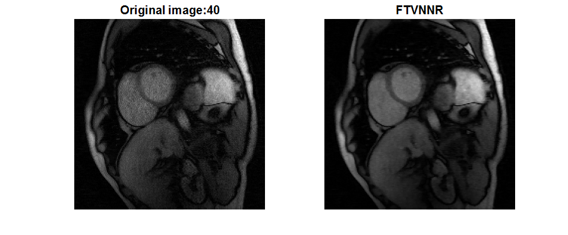

# FTVNNR_Dynamic_MRI
This contains source codes of MedIA18 paper

---

## An efficient algorithm for dynamic MRI using low-rank and total variation regularizations
By Jiawen Yao, Zheng Xu, Xiaolei Huang, Junzhou Huang, In *Medical image analysis*, *Vol. 44, 14-27, 2018*

FTVNNR was initially published in [MICCAI 2015](https://link.springer.com/chapter/10.1007/978-3-319-24571-3_76) .

### Contents
1. [Requirements: software](#requirements-software)
2. [Demo](#demo)

### Requirements: software

- MATLAB
- A toolbox for compressive sensing (CS) magnetic resonance imaging (MRI) with structured sparsity [[MATLAB Code]](http://web.engr.illinois.edu/~cchen156/SSMRI.html)
  - I have already integrated this toolbox here. But please consider citing the above work when using in your research.

### Demo
Run the demo_FTVNNR.m and you will see the following results:

  

If you find FTVNNR useful in your research, please consider citing:

    @article{yao2018efficient,
      title={An efficient algorithm for dynamic MRI using low-rank and total variation regularizations},
      author={Yao, Jiawen and Xu, Zheng and Huang, Xiaolei and Huang, Junzhou},
      journal={Medical image analysis},
      volume={44},
      pages={14--27},
      year={2018},
      publisher={Elsevier}
    }
    
    @inproceedings{yao2015accelerated,
      title={Accelerated dynamic MRI reconstruction with total variation and nuclear norm regularization},
      author={Yao, Jiawen and Xu, Zheng and Huang, Xiaolei and Huang, Junzhou},
      booktitle={International Conference on Medical Image Computing and Computer-Assisted Intervention},
      pages={635--642},
      year={2015},
      organization={Springer}
    }
